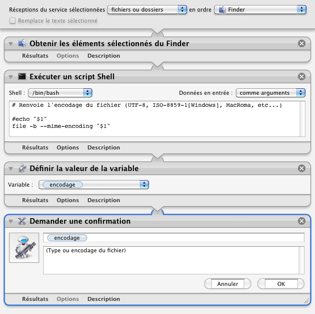

## Afficher l'encodage

Ce processus ouvre une boîte de dialogue affichant l'encodage du fichier sélectionné.

1. Sélectionner l'élément à analyser (un fichier)
2. Clic droit sur la sélection
3. Choisir "Services" ▶ "Afficher l'encodage".

