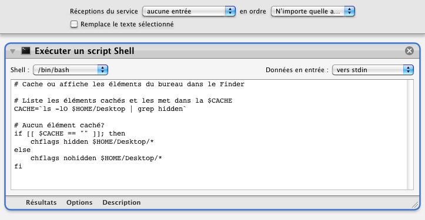

## Afficher ou Cacher les éléments du Bureau

Ce processus permet de cacher les icônes sur votre bureau (on a l'impression que le bureau est vide). De la même manière, il les affiche à nouveau.

1. Clic sur l'icône "Finder"
2. Aller dans le menu "Finder" | "Services" ▶ Afficher ou Cacher les éléments du Bureau (dans la section "Général")
3. Idem pour faire réapparaître les icônes.

