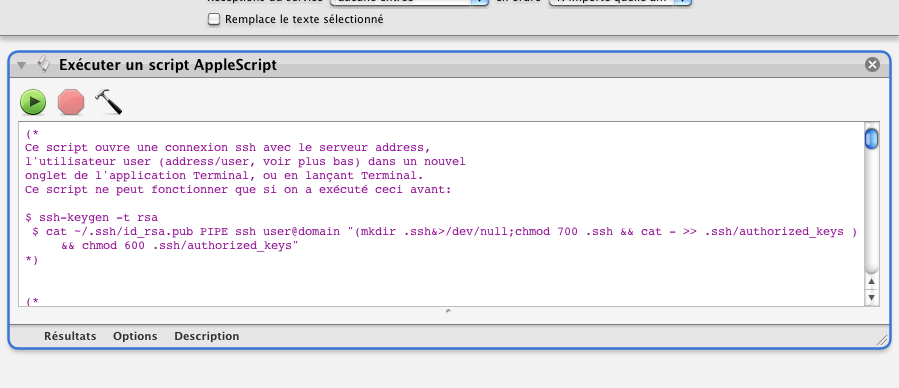

## Connecter un serveur SSH

Ce processus permet de se connecter en ssh sur un serveur.

1. Clic sur l'icône "Finder"
2. Aller dans le menu "Finder" | "Services" | Connecter ssh macmini (dans la section "Général")
3. Il faut modifier deux variables situées à la fin du script applescript contenu dans le processus:
    - user (donner un nom d'utilisateur enregistré)
    - address (adresse du serveur ssh)
    - De plus, il faut faire ce qui est demandé dans les commentaires du début du script applescript : lancer la commande dans le Terminal en remplaçant "user" et "domain" par les valeurs adéquates. Sinon, la connexion ne peut pas être automatique (demande de mot de passe).

