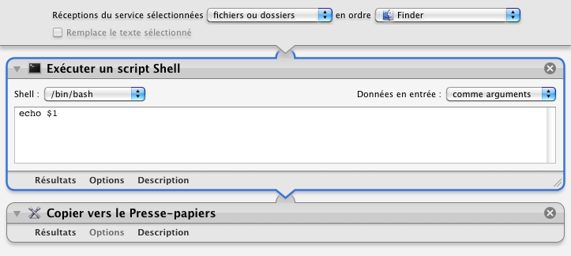

## Copier le chemin Unix dans le Presse-papier

Ce processus permet de mettre le chemin Unix de l'élément sélectionné dans le presse-papier.

1. Sélectionner l'élément à analyser (un fichier ou un dossier)
2. Clic droit sur la sélection
3. Choisir "Services" ▶ "Copier le chemin Unix dans le Presse-papier"

