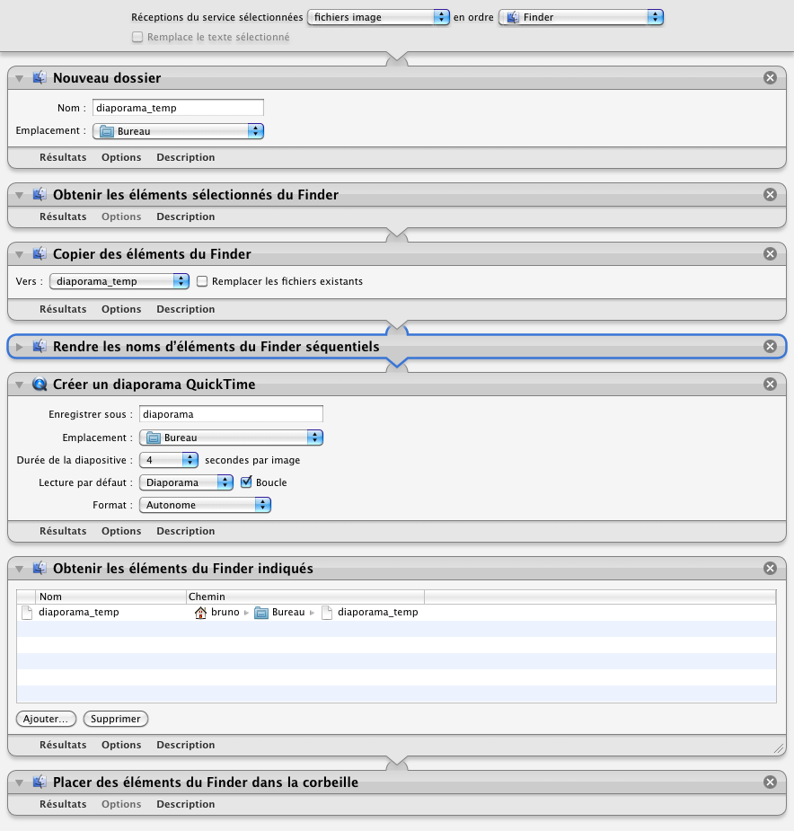

## Créer un diaporama.mov

Ce processus permet de créer une vidéo diaporama des photos sélectionnées.

1. Sélectionner les photos
2. Clic droit sur la sélection
3. Choisir "Services" | "Créer un diaporama.mov". Un fichier diaporama.mov est créé sur le bureau

*Le diaporama sera au format 640x480 et seules les images en mode paysages sont gérées.**

