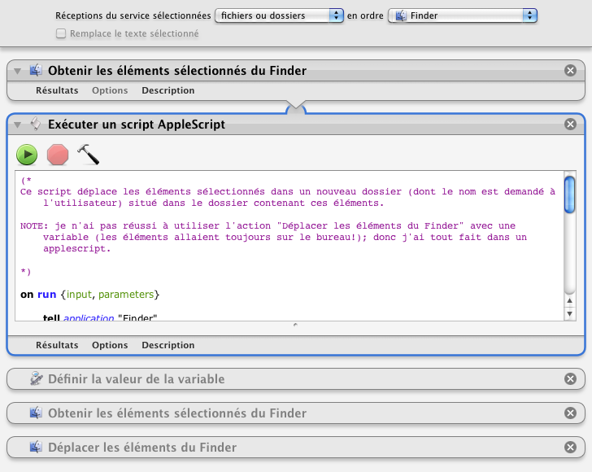

## Déplacer dans un nouveau dossier

Ce processus permet de déplacer les éléments sélectionnés (fichiers et/ou dossiers) dans un dossier nouvellement créé dans le dossier en cours.

1. Sélectionner les éléments
2. Clic droit sur la sélection
3. Choisir "Services" ▶ "Déplacer dans un nouveau dossier"
4. Une fenêtre de dialogue s'ouvre pour demander le nom du nouveau dossier.

*Je n'ai pas utilisé l'action "Nouveau dossier" incluse dans Automator car elle ne fonctionnait pas avec une variable.*

