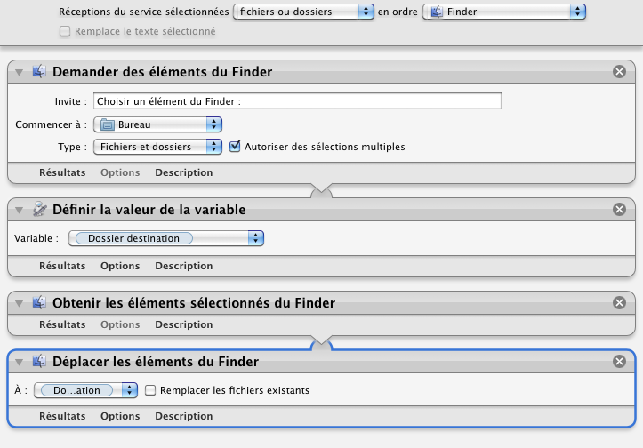

## Déplacer vers ...

Déplace les éléments sélectionnés dans le dossier spécifié.

1. Sélectionner les éléments à déplacer (fichiers et/ou dossiers)
2. Clic droit sur la sélection
3. Choisir "Services" ▶ "Déplacer vers...".

