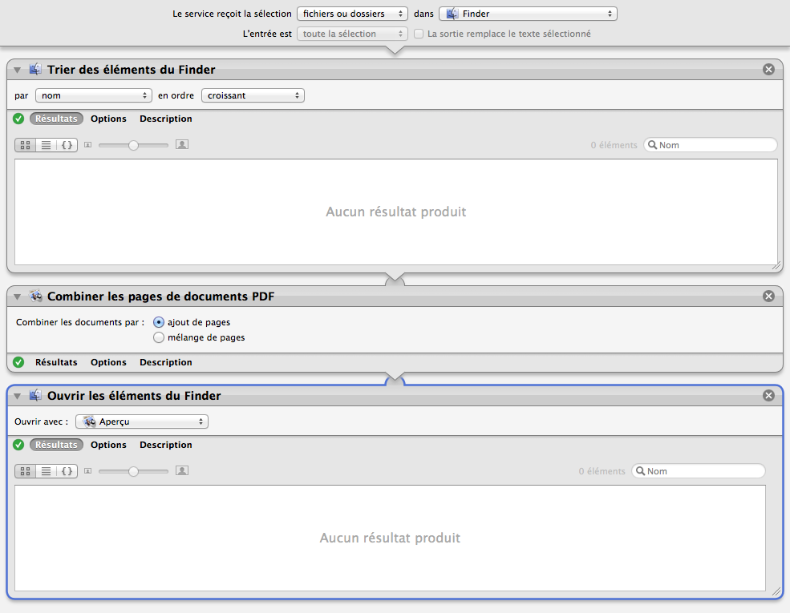

## Fusionner les fichiers PDF triés

Permet de créer un unique fichier PDF à partir d'autres fichiers PDFs dont le nom est une séquence.

1. Sélectionner les fichiers PDFs à fusionner
2. Renommer-les pour que leur nom comporte une séquence
2. Clic droit sur la sélection
3. Choisir "Services" ▶ "Fusionner les fichiers PDF triés".

