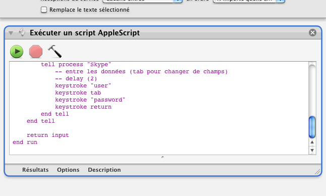

## Lancer Skype

Ce processus permet de démarrer Skype en faisant entrer ses identifiants de connexion par un script.

1. Clic sur l'icône "Finder"
2. Aller dans le menu "Finder" | "Services" ▶ "Lancer Skype" (dans la section "Général")

*Ce processus est très personnel, puisqu'il s'agit plutôt d'une expérience. Pour le faire marcher, il faudra modifier le script AppleScript contenu dans le processus pour modifier les coordonnées du clic de souris dans le Dock. Celui-ci doit tomber sur l'icône Skype de votre Dock. De plus, il faudra mettre vos identifiants Skype dans le script.**

