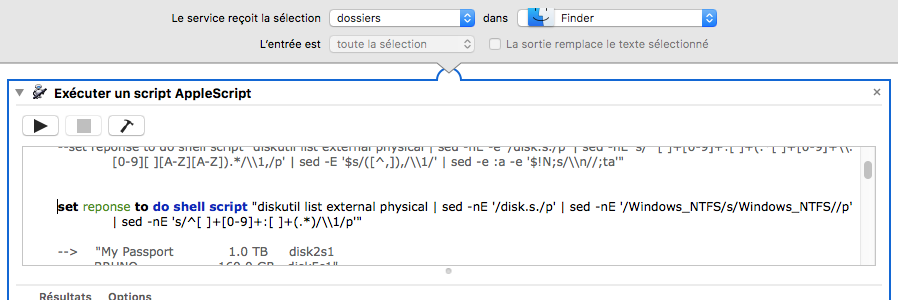

## Monter un disque NTFS

Permet de monter un disque NTFS en écriture (par défaut, les disques NTFS sont montés en lecture seule dans mac OS X).
Il faut installer ntfs-3G avant.

1. Sélectionner le disque à monter en écriture (optionel)
2. Clic droit sur la sélection
3. Choisir "Services" ▶ "Monter un disque NTFS"
4. Une fenêtre de dialogue s'ouvre pour demander le mot de passe administrateur.

**Remarques :**

- Fuse for mac os x doit être installé
- NTFS-3G doit être installé

