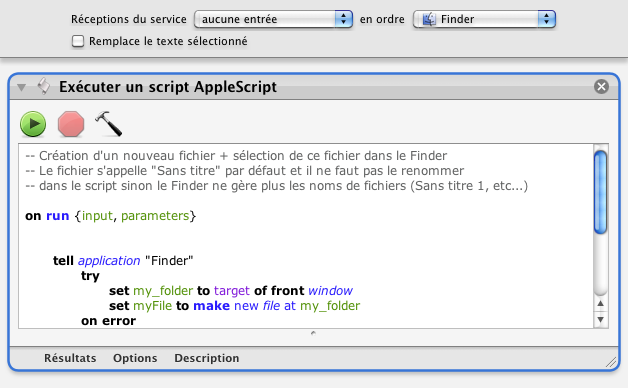

## Nouveau fichier texte

Ce processus permet de créer un fichier texte dans la fenêtre de Finder en cours.

1. Clic sur l'icône "Finder"
2. Aller dans le menu "Finder" | "Services" | "Nouveau fichier texte" (dans la section "Général")
3. Un fichier "sans titre.txt" apparaît dans la fenêtre du Finder en cours

_L'incrémentation du nom du fichier se fait automatiquement (sans titre 2, sans titre 3, etc...)._

