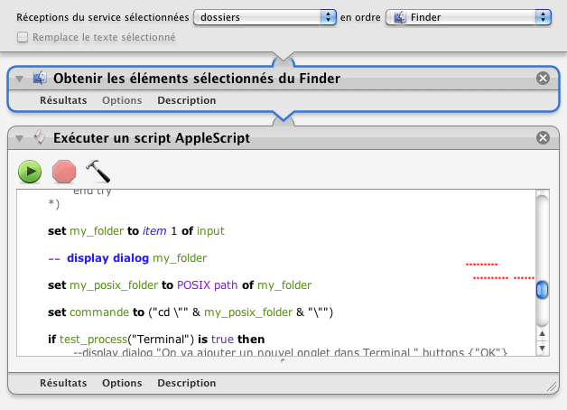

## Ouvrir dans Terminal

Ce processus permet d'ouvrir un dossier dans le Terminal.

1. Clic droit sur un dossier
2. Choisir "Services" ▶ "Ouvrir dans Terminal"
3. Terminal s'ouvre dans ce dossier

_Si Terminal est déjà lancé, un nouvel onglet est créé._

