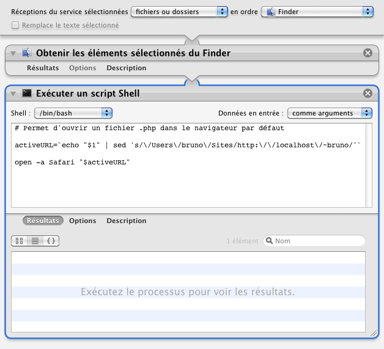

## Ouvrir .php dans Safari

Ce processus permet d'ouvrir un fichier .php dans Safari et y être interprété par le serveur apache.

1. Clic droit sur un fichier .php
2. Choisir "Services" ▶ "Ouvrir .php dans Safari"
3. Safari s'ouvre et affiche le fichier .php interprété

*Il faut modifier le script bash contenu dans le processus pour changer "bruno" en votre nom d'utilisateur.  
De plus, le fichier .php devra se situer dans le dossier /Users/moi/Site (ou un de ses sous-dossier) car c'est le dossier apache par défaut. Il est possible de modifier l'emplacement de ce dossier en modifiant la variable "DocumentRoot" dans le fichier /private/etc/apache2/httpd.conf.*

