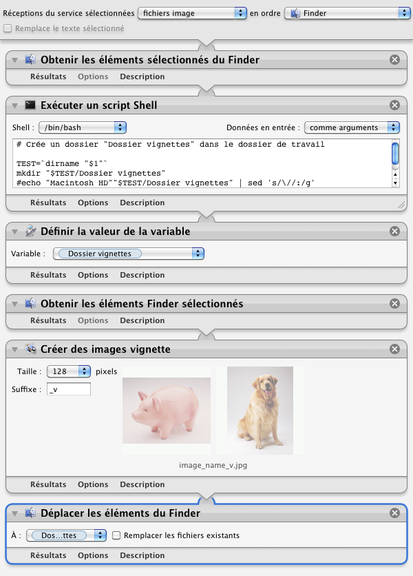

## Photos en vignettes

Ce processus permet de transformer des photos en vignettes de 128 pixels de hauteur ou largeur (selon que la photo est en mode portrait ou paysage).

1. Clic droit sur une photo (ou une sélection de photos)
2. Choisir "Services" ▶ "Photos en vignettes"
3. Un dossier "Dossier vignettes" va se créer dans la fenêtre de Finder en cours qui va contenir les photos en vignette

