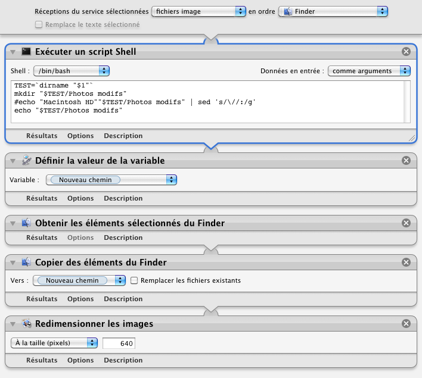

## Redimensionner ...

Ce processus permet de redimensionner la taille des photos (en pixels ou en pourcentage).

1. Clic droit sur une photo (ou une sélection de photos)
2. Choisir "Services" ▶ "Redimensionner ..."
3. Un dossier "Photos modifs" va se créer dans la fenêtre de Finder en cours qui va contenir les photos modifiées. Puis une fenêtre de dialogue va s'afficher proposant de redimensionner en pixel ou en pourcentage

