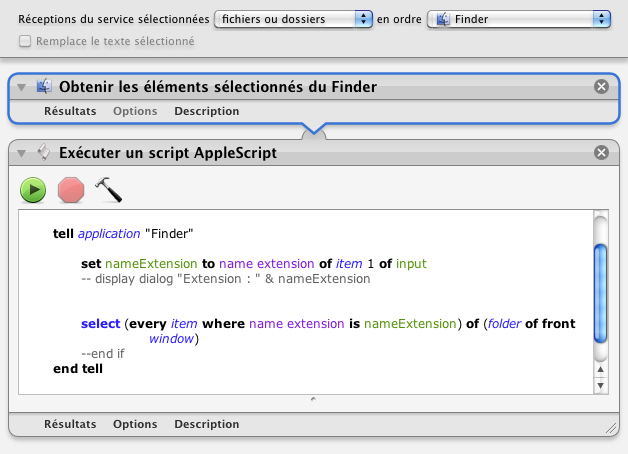

## Sélectionne même type

Ce processus permet de sélectionner tous les éléments du même type dans une fenêtre du Finder.

1. Clic droit sur un élément (un fichier)
2. Choisir "Services" ▶ "Sélectionne même type"
3. Tous les éléments du même type sont sélectionnés (exemple: tous les fichier .jpg)

